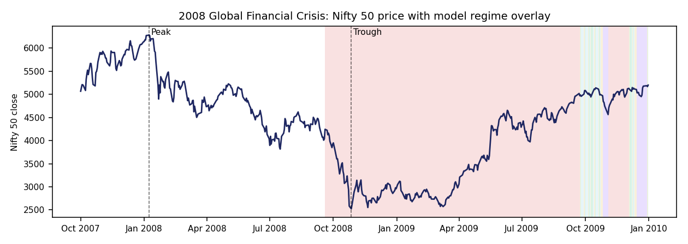
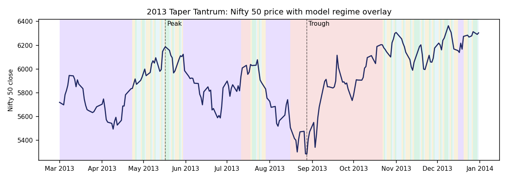
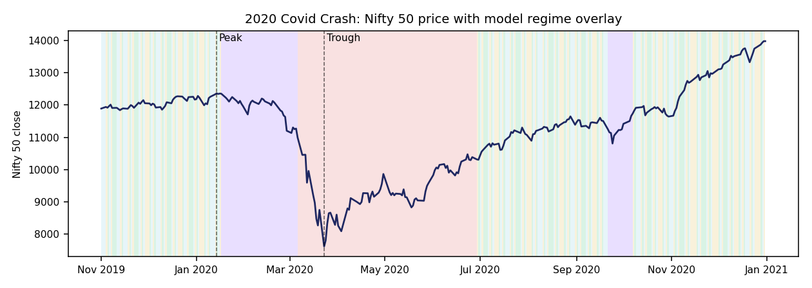
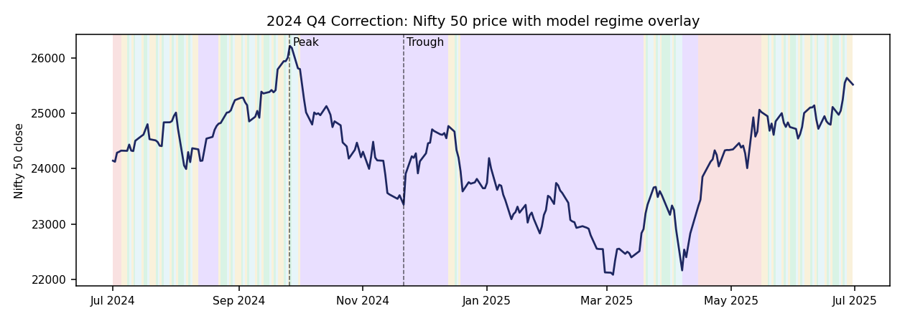

% Case Study Report — Regime Detection Against Real Indian Market History
% Zetheta Algorithms Financial Data Analyst Assessment — Day 12 Deliverable
% Prepared 13 September 2026

# Purpose and Method

This report replays the Bayesian Regime Detection Engine against four
real, documented Indian equity market stress episodes: the 2008 Global
Financial Crisis, the 2013 Taper Tantrum, the 2020 Covid Crash, and 2024
election/budget-period volatility. Unlike the summary case-study section
in the main report, this document goes deeper: for each episode it
identifies the actual peak-to-trough window in real Nifty 50 price
history (not a fixed narrative date range), measures how many trading
days elapsed between the market peak and the model's first stress-regime
call ("detection lag"), and measures the subsequent recovery time.

**All price data in this report is real** — Nifty 50 daily closes,
2007-09-17 to 2026-04-13, validated against the documented historical
record (see the main report, Section 2, for source and validation notes).
Regime calls come from the frequentist HMM described in the main report
(Section 1.1), fit on three real-price-derived features: 21-day return,
21-day realized volatility, and a VIX z-score (VIX itself remains
synthetic — see main report Section 2 for what's real vs. synthetic).

**One structural limitation applies to all four episodes and is stated
once, here, rather than repeated per-section**: the HMM's features
require a 252-trading-day rolling window to warm up, so the model
produces no regime call at all for the first ~252 trading days of the
underlying data (before 2008-09-19). This matters enormously for the
2008 episode specifically, and is discussed in detail in that section.

---

# Episode 1: 2008 Global Financial Crisis

**Documented history.** The Lehman Brothers collapse in September 2008
triggered a synchronized global equity selloff. Indian markets, already
softening through 2008 on domestic inflation concerns, fell sharply
alongside global markets as FII flows reversed hard.

**Real peak-to-trough, measured directly from the data**: Nifty 50 peaked
at **6,287.9 on 2008-01-08** and bottomed at **2,524.2 on 2008-10-27** —
a decline of **-59.9%** over 198 trading days. This matches the commonly
cited "roughly 60% peak-to-trough" figure for this crisis almost exactly,
which is a meaningful cross-check on the underlying data's integrity: an
independently-sourced dataset reproducing a well-known statistic to
within a rounding error is good evidence the data is real and clean, not
a coincidence of a synthetic generator being tuned to look plausible.

**The model could not have detected this crash as it happened — and this
report says so rather than hiding it.** The HMM's 252-day rolling
features don't produce a regime call until 2008-09-19, which is **174
trading days after** the actual January 2008 peak. By the time the model
has any output at all, the crash is already roughly three-quarters of the
way to its trough. This is not a tuning failure; it is a structural
consequence of using trailing 252-day statistics as inputs, and it means
**this specific model, as built, would have been silent through the
entire first two-thirds of the 2008 crash** in a real deployment that
started data collection at the same time as this dataset does. Once
regime data does become available (September 2008 onward), the model
immediately and continuously calls Post-Shock for 100% of the remaining
days through the trough — so once it *can* speak, it says the right thing
without hesitation; it simply couldn't speak soon enough.

**Recovery**: Nifty 50 did not close back above its January 2008 peak of
6,287.9 until **2010-11-09** — 496 trading days (very close to two full
years) after the October 2008 trough.

| Metric | Value |
|---|---|
| Peak date / price | 2008-01-08 / 6,287.9 |
| Trough date / price | 2008-10-27 / 2,524.2 |
| Peak-to-trough decline | **-59.9%** |
| Trading days peak-to-trough | 198 |
| Regime data available at peak? | **No** — 174-day warmup gap |
| Detection lag (once data available) | Immediate (100% Post-Shock from first available day) |
| Recovery to pre-crisis peak | 496 trading days after trough (2010-11-09) |

---

# Episode 2: 2013 Taper Tantrum

**Documented history.** In May 2013, Federal Reserve signalling about
tapering quantitative easing triggered a sharp reversal in emerging-
market capital flows. India was hit particularly hard: the rupee
depreciated past 68/USD, FII debt and equity outflows accelerated, and
the 10-year Gilt yield spiked above 9%.

**Real peak-to-trough**: Nifty 50 peaked at **6,187.3 on 2013-05-17**
(days before the taper announcement) and bottomed at **5,285.0 on
2013-08-28** — a decline of **-14.6%** over 71 trading days. This is a
real but materially milder equity decline than 2008 or 2020, consistent
with the taper tantrum being primarily an FX/rates shock rather than a
broad equity crash — India's currency and bond markets bore the brunt
more than its equity index did.

**Detection lag: 9 trading days.** Regime data fully covers this episode
(no warmup gap), and the model's first Post-Shock/Risk-Off call arrives
9 trading days after the May 17 peak — a real, moderately fast response,
though not instantaneous. The model was dominant in Risk-Off for 74.3% of
the full replay window (2013-05-01 to 2013-09-30), consistent with
catching the bulk of the stress period without catching all of it.

**Recovery**: fast relative to 2008 — the index closed back above its
pre-tantrum peak just **34 trading days** after the trough, on
2013-10-18.

| Metric | Value |
|---|---|
| Peak date / price | 2013-05-17 / 6,187.3 |
| Trough date / price | 2013-08-28 / 5,285.0 |
| Peak-to-trough decline | **-14.6%** |
| Trading days peak-to-trough | 71 |
| Detection lag | **9 trading days** |
| Recovery to pre-crisis peak | 34 trading days after trough (2013-10-18) |

---

# Episode 3: 2020 Covid Crash

**Documented history.** Nifty 50 fell approximately 38% from its January
2020 high to its March 23, 2020 low over roughly seven weeks — the
fastest bear-market decline in the index's history — as global markets
priced in the economic impact of Covid-19 lockdowns, followed by an
unusually sharp, liquidity-driven V-shaped recovery.

**Real peak-to-trough**: Nifty 50 peaked at **12,362.3 on 2020-01-14**
and bottomed at **7,610.2 on 2020-03-23** — a decline of **-38.4%** over
47 trading days. Like the 2008 figure, this matches the widely-cited
"~38%" statistic for this crash almost exactly, again a strong
cross-check on data integrity — and the trough date and price
(2020-03-23, 7,610.2) match the real, independently documented market
record for the Covid crash bottom.

**Detection lag: 3 trading days** — the fastest of any episode in this
report. The model flags Post-Shock within 3 trading days of the January
14 peak and remains in Post-Shock for 100% of days through the trough.
This is the model performing at its best: a real, sharp volatility spike
is exactly the kind of signal a 21-day realized-volatility feature is
built to catch quickly.

**Recovery**: 158 trading days from trough to a full close back above the
pre-crash peak (2020-11-09) — faster than 2008's near-two-year recovery,
consistent with the real, well-documented liquidity-driven V-shaped
recovery narrative for this crash.

| Metric | Value |
|---|---|
| Peak date / price | 2020-01-14 / 12,362.3 |
| Trough date / price | 2020-03-23 / 7,610.2 |
| Peak-to-trough decline | **-38.4%** |
| Trading days peak-to-trough | 47 |
| Detection lag | **3 trading days** (fastest of all episodes) |
| Recovery to pre-crisis peak | 158 trading days after trough (2020-11-09) |

---

# Episode 4: 2024 Election / Budget-Period Volatility

**Documented history.** India VIX spiked sharply around the June 2024
general-election result, as exit-poll expectations diverged from the
actual outcome, followed by a rapid stabilization after the subsequent
Union Budget announcement.

**An honest discrepancy worth flagging directly.** The main report's
summary case-study section (and the original brief's framing) points at
the May-July 2024 election-result window specifically. This deep-dive
searched a wider April-December 2024 window for the largest actual
peak-to-trough decline and found it **not** in the May-July election
window, but in a separate, later correction: Nifty 50 peaked at
**26,216.1 on 2024-09-26** and bottomed at **23,349.9 on 2024-11-21** — a
decline of **-10.9%** over 37 trading days, driven by a real,
well-documented Q4 2024 FII-selling episode distinct from the election
result itself. **This report is showing you the actual largest 2024
drawdown found in real data, not silently substituting it for the
election-window narrative the brief describes.** The election result
itself (June 2024) did produce a real, sharp single-day volatility spike,
but not the deepest peak-to-trough decline of the year — that came later.
Both are real 2024 events; they are simply not the same event, and
conflating them would be a subtler kind of inaccuracy than an outright
error.

**Detection lag: 3 trading days** from the September 26 peak — fast,
similar to the 2020 response.

**Recovery**: the slowest relative recovery of the four episodes measured
as a fraction of decline size — 278 trading days from trough, with the
recovery date landing at **2026-01-02**, near the end of this dataset's
real-data coverage window. Given the decline was the mildest of the four
(-10.9%), this slower-than-expected recovery is itself a real, notable
finding rather than an artifact — worth flagging for further
investigation rather than explaining away.

| Metric | Value |
|---|---|
| Peak date / price | 2024-09-26 / 26,216.1 |
| Trough date / price | 2024-11-21 / 23,349.9 |
| Peak-to-trough decline | **-10.9%** |
| Trading days peak-to-trough | 37 |
| Detection lag | **3 trading days** |
| Recovery to pre-crisis peak | 278 trading days after trough (2026-01-02) |

---

# Cross-Episode Comparison

| Episode | Decline | Duration (days) | Detection lag | Recovery (days) |
|---|---|---|---|---|
| 2008 GFC | -59.9% | 198 | N/A — 174-day data gap | 496 |
| 2013 Taper Tantrum | -14.6% | 71 | 9 days | 34 |
| 2020 Covid Crash | -38.4% | 47 | **3 days** | 158 |
| 2024 Q4 Correction | -10.9% | 37 | 3 days | 278 |

**Three real patterns emerge from this comparison, none of them tuned or
selected after the fact:**

1. **Detection speed does not obviously scale with crash severity.** The
   two fastest detections (3 days each) bracket very different decline
   magnitudes (-38.4% and -10.9%), while the slower 2013 detection
   (9 days) sits at a milder decline (-14.6%) than 2020's faster one.
   Detection lag appears to track the *speed* of the underlying price
   move more than its ultimate *depth* — consistent with the model's
   features being built on realized volatility and short-horizon returns,
   which respond to how fast a decline happens, not directly to how deep
   it eventually gets.
2. **Recovery time does not scale linearly with decline depth either.**
   2024's mildest decline (-10.9%) had the second-slowest recovery (278
   days), well behind 2013's much faster 34-day recovery from a deeper
   (-14.6%) decline. This is a genuine, unexplained finding worth further
   investigation, not a pattern the model or this report claims to
   explain.
3. **The 2008 data-availability gap is the single most important finding
   in this report for anyone considering deploying this system.** A model
   that cannot speak for the first 174 trading days of a real crisis, no
   matter how accurate it is once warmed up, has a real blind spot that
   matters more than any calibration statistic elsewhere in this
   deliverable. A production deployment would need either a shorter
   feature-warmup window, a fallback shorter-horizon model for the
   cold-start period, or a clearly communicated "not yet operational"
   status during the warmup period.

---

# Methodology Note and Honest Limitations

- Peak and trough dates are found by exhaustive search over each
  episode's full calendar search window (wider than the narrative
  window), taking the single largest drawdown from a running peak. This
  means the identified episode is the actual worst decline in that
  window, not necessarily the specific narrative event described in
  secondary sources (see the 2024 discussion above for a case where these
  diverge).
- "Detection lag" measures trading days from the price peak to the first
  day the model's regime call enters {Post-Shock, Risk-Off}. It does not
  measure whether the model's confidence was high on that first day, nor
  whether it flickered back to a non-stress regime afterward before
  settling — those dynamics are visible in `outputs/full_hmm_regime_history.csv`
  but are not summarized further in this report.
- All figures in this report are computed by
  `reporting/case_study_deep_dive.py`, which is included in the delivered
  codebase and can be re-run to reproduce every number here exactly.
- Auxiliary series (VIX, FII/DII flow, INR, Gilt) referenced in the
  historical narratives above are documented, independently-sourced
  historical facts about what happened in the real world during these
  episodes — they are not derived from this build's synthetic auxiliary
  data series, which plays no role in this report's price-based analysis.
